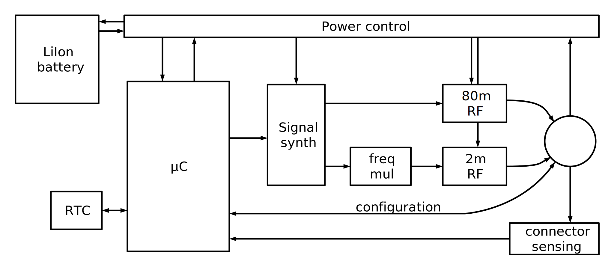

# sicufox

This project implements a fully automatic fox controller for ARDF competitions, capable of running all modes of operations presented in the IARU Region 1 rules for ARDF events, having an easy to use user interface for configuring and safe and easy deployment possibility.

## Specifications

The fox controller shall observe the IARU R1 ARDF rules and technical specifications for transmitters.

### Operational specs:

- carrier frequency: 3.510 - 3.600 MHz / 144.500 - 144.900 MHz
- frequency stability: 50 ppm
- output RF level: 1 - 5W / 0.25 - 1W
- modulation: A1A/ A2A
- transmitting code: MOE, MOI, MOS, MOH, MO5, MO, S
( -- --- . , -- --- .. , -- --- ... , -- --- .... , -- --- ..... , -- --- , ... ) 
- keying speed: 8 - 15 wpm

The transmitter shall be capable of operating for 80m classic, 2m classic, sprint and foxoring events.
To ensure this the following configurations should be able to be stored in the transmitter:

- transmit timing: continuous, interval: 1/2, 1/3, 1/4, 1/5, interval periods: 12s, 60s
- code wpm: 8, 9, 10, 11, 12, 13, 14, 15
- output power: 100mW, 500mW, 1W, 3W, 5W
- working frequency: 3.510, 3.520, 3.530, 3.540, 3.550, 3.560, 3.570, 3.580, 3.590, 3.600 MHz
- frequency accuracy: +-150Hz
- carriers and modulated tones are directly synthesized in µC

Configuring the transmitter shall be done on a dedicated interface attached to the fox, or on a computer attached to the fox. Configurations shall be preserved indefinitely (store in EEPROM).
Clock synchronization is realized while configuring from the external device. Clock synchronization shall be kept while on battery power, at least 10 days.
 
Battery operation:
battery should last at least a whole competition in active transmission, while in power save mode at least 10 days. Power saving is active while no antenna is connected to the fox. When antenna is connected the fox becomes active according to the configured transmission cycle.

### Hardware specs:

- Power source: internal LiIon battery, 7.4V -- 11.1V
- Output power: max 5W
- Active current consumption: 1A
- Battery capacity: 8Ah
- Power down mode: <200µA

#### Sleep mode:
The fox enters sleep mode when no external device or antenna is connected. In sleep mode all transmitter circuits ar powered down, the microcontroller enters into a power saving mode, and power to every other circuit is cut. Only the RTC is working to maintain clock synchronization.

- µC internal RTC shall be used if possible

#### External connector:
The only connector of the fox is used for connecting the antenna, connecting the configuration interface (via a serial bus), and for charging the internal battery. When nothing attached to the connector, the µC enters sleep mode. If antenna is connected, then µC wakes up and starts transmitting according to the configured cycle. When external power is connected the µC and transmitter remains in sleep mode, but a battery charging circuit activates and starts recharging the battery. When serial interface is connected, the µC wakes up, but all other circuitry remains in power down mode, giving the possibility to send configuration data to be stored into a non-volatile location. Also during serial connection the RTC synchronization shall occur.

A 5 pin waterproof connector shall be used:
- GND
- 80m antenna
- 2m antenna
- charge / antenna selector
- serial

#### RF stage:

- 80m: direct frequency synthesis from µC, linera amplifier (controlled gain) and filters for harmonic suppression (according to ANCOM rules), basic antenna tuning support and high swr resistance
- 2m: IF frequency synthesis with tone modulated CW carrier, superheterodine RF switching and output filter, matched antenna
- digital circuitry interference isolation

## System architecture

Block diagram of the system is presented on the figure below:

The central part of the system is the microcontroller responsible of managing all the RF stages and signal conditioning. It is also able to control the power flow to these stages to achieve various power down modes and disable power consumption of unused parts. The power control is also responsible for charging and monitoring the embedded LiIon battery. Charging is done by connecting an external power source to the i/o connector. The microcontroller can disable power to every component except for the Real-Time Clock which runs continuously from battery power to maintain synchronization of the foxes. Besides this only the connector sensing works in power down mode, which will wake up the microcontroller as needed when external connections are made to the device.

In active state the microcontroller controls a direct signal synthesis module creating the CW modulated carrier for 80m operation or the tone modulated CW intermediate frequency signal which is fed through a frequency changing module (either PLL or superheterodine stage). Radio frequency signals (80m or 2m) are then amplified with a programmable gain (controlled from the microcontroller) and output to the corresponding i/o connector to a matched antenna. The RF stage contains the necessary filtering and optional matching circuits.

The microcontroller is also connected to the i/o connector using a bidirectional serial communication for configuring modes of operation and syncing for the given competitions.
